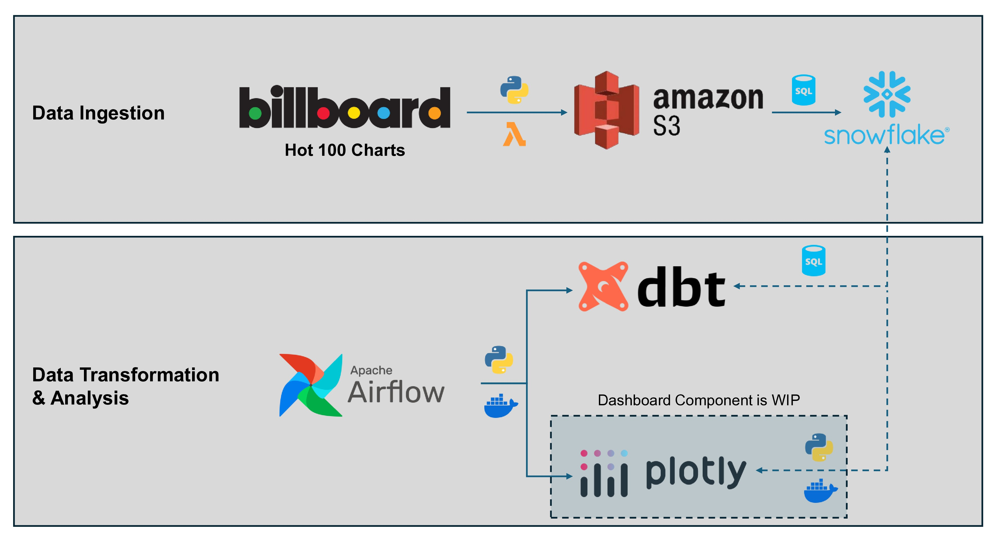

# Billboard Hot 100 Analytics Pipeline

## Project: End-to-End Data Pipeline for Music Charts Analysis 
### Goal
Implement a production-ready data pipeline transforming raw music charts data into clear insights.
### Outcomes
* **Business insights:** Extracted from raw data across multiple sources, providing actionable information.
* **Automated updates:** Scheduled transformations ensure insights remain current and reliable.
* **Enterprise scalability:** Robust and scalable pipeline capable of handling large, complex data workloads.
* **Flexible setup:** Modular structure makes it easy to update or extend the pipeline.
### Implementation


#### Data Ingestion
* Scraping data from Billboard Hot 100 charts using AWS Lambda and storing the data in an S3 bucket
* Loading and syncing S3 data to a Snowflake database
* The ingestion pipeline runs once every week to account for charts updates
#### Data Transformation & Analysis
* Several dbt models transform the raw data in Snowflake into useful insights for analytics
* (*Not yet implemented*) After data transformation, a dashboard is built to visualize the key insights at a glance
* The dbt and dashboarding steps are orchestrated by a containerized Airflow implementation

*Note: This repository contains the source code for the "Data Transformation & Analysis" part of the pipeline. For guidance on how to implement the data ingestion, feel free to reach out (see contact info below)!*

### Technology
* AWS Lambda & S3 for data scraping and storage
* Snowflake for data warehousing & querying
* SQL & data build tool (dbt) for data transformations
* Python & Airflow for scheduling & orchestration
* Docker for containerized deployment

## Repository Structure
* `airflow/`: Contains the DAGs and configuration files for Airflow to schedule and run ETL workflows.
* `dbt/billboard_hot_100/`: Houses dbt models and transformations for preparing the data for analytics.
* `resources/`: Includes files used for documentation as well as example datasets.
* `scripts/`: Contains python scripts used in the airflow DAG.
* `README.md`: Documentation for the project setup and usage.
* `docker-compose.yaml`: Docker Compose configuration to set up the development environment.

## Setup Guide
*Note: This setup guide aims to be complete, but high-level. If you need guidance in implementing a specific step, please reach out (see contact info below)*.
### 1. Get the Data
I adapted the code from [this repository](https://github.com/jsubroto/billboard-hot-100-web-scraper/tree/main) to scrape the billboard data. Additionally, I used ChatGPT to generate additional information on all artists in the current hot 100 charts (country and genre). Since this repo focuses on data transformations, you can find the two data sources as static csv files under `resources/data/`. `billboard_hot_100.csv` contains the Billboard charts as of 31.10.24. `artist_data.csv` contains additional information about most (but not all) artists in the hot 100.
### 2. Load Data into Snowflake
* **Option 1**: Manually ingest the data into Snowflake from your local drive as static tables.
  * "Quick and dirty" solution. Do this if you are purely interested in the data transformation & analysis and do not intend to set up an end-to-end pipeline.

* **Option 2**: Set up an automated scraping mechanism that loads the data into Snowflake and updates it frequently. For example, a combination of AWS Lambda functions and S3 Buckets can achieve this.
  * Sophisticated solution. Requires cloud skills and additional setup effort, but allows for scheduled updates of data & insights.

### 3. Configure profiles.yml for Snowflake
To enable dbt to connect to Snowflake, create a profiles.yml file and place it under `dbt/profiles.yml` in this repo. Use the template in `dbt/profiles.yml.template` for inspiration. Consider carefully if you want to put in your account details explicitly or use environment variables instead.

### 4. Run Docker Containers
Start the Docker environment by running:

```bash
docker-compose up -d
```
This command sets up the necessary containers for dbt and Airflow.

### 5. Access Airflow, Log In, and Run the DAG
* Open a web browser and go to `http://localhost:8080` to access the Airflow UI.
* Log in using the default credentials:
    * Username: admin
    * Password: admin_password
* Locate the DAG for this pipeline, activate it, and then trigger a run to start processing the data.

### 6. Access Insights
#### Analyze Snowflake Tables
Analyze the clean data tables using SQL. For example, this command will show you the top 10 songs with additional artist information:
```SQL
SELECT *
FROM hot_100_artists
LIMIT 10;
```
This command shows you the charts data broken down by country:
```SQL
SELECT *
FROM countries;
```

#### View Dashboard
The dashboard part of the pipeline is not implemented, yet.

## Contact Information
For questions or contributions, reach out to Max Hilsdorf via [Email](mailto:m.hilsdorf1@gmail.com) or on [LinkedIn](https://www.linkedin.com/in/max-hilsdorf/).

## License
This project is licensed under the MIT License (see [LICENSE](LICENSE)).